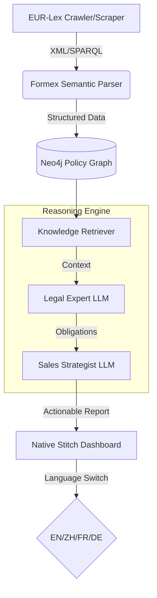

# EuroPolicy-Agent (EPA) 🇪🇺🤖

> **Transforming EU Regulatory Complexity into Actionable Business Intelligence.**

[](https://github.com/google-labs-code/stitch-skills)
[](https://langchain-ai.github.io/langgraph/)
[](https://stitch.withgoogle.com/)

## 🌟 The Vision

Navigating the **European Union's regulatory landscape** (CBAM, RED III, Battery Regulation, AI Act) is a survival challenge for global exporters. **EuroPolicy-Agent** is an agentic reasoning engine that bridges the gap between massive, multi-lingual legal PDF/XML databases and high-stakes business decisions.

EPA doesn't just search; it **reasons**. By combining a **Knowledge Graph (Neo4j)** of policy topology with **LangGraph-driven agentic workflows**, it extracts specific obligations and synthesizes risk-mitigated sales strategies in seconds.

---

## 🚀 Key Capabilities

### 1. 🧠 Agentic Reasoning (LangGraph)
A multi-node brain that separates concerns:
- **Legal Expert Node**: Translates 100-page directives into "Plain Human" obligation lists.
- **Strategist Node**: Synthesizes contractual clauses, price adjustments, and supply chain pivoting strategies.

### 2. 🕸️ Regulatory Knowledge Graph (Neo4j)
Not just a database, but a map:
- Tracks `(Directive)-[:HAS_ARTICLE]->(Article)-[:RECITES]->(Standard)`.
- Follows the amendment timeline: `(Old_Article)-[:SUPERCEDED_BY]->(New_Article)`.

### 3. 📑 Formex Deep Parser
Native support for EU **Formex XML** structures. Unlike basic RAG, EPA understands the semantic hierarchy of legal documents—distinguishing between "recitals" and "binding articles."

### 4. 🌐 Multilingual Native Dashboard
A premium, **Google Stitch-inspired** interface supporting **English, 简体中文, Français, and Deutsch**. Zero-latency page transitions and high-fidelity data visualization.

---

## 🏗️ System Architecture



---

## 🛠️ Getting Started

### Prerequisites
- **Python 3.10+** (Reasoning Engine)
- **Neo4j Desktop / Aura** (Knowledge Base)
- **Gemini 1.5 Pro / Flash API Key**

### 1. Installation
```bash
git clone https://github.com/your-username/EuroPolicy-Agent.git
cd EuroPolicy-Agent
pip install -r requirements.txt
```

### 2. Launch the Brain (CLI)
```bash
export GEMINI_API_KEY="your_api_key"
python reasoning_agents/policy_graph_agent.py
```

### 3. Run the Dashboard
EPA provides a premium native experience (No Python-UI dependencies required for the frontend):
```bash
cd dashboard-native
python3 -m http.server 8686
```
Visit `http://localhost:8686` in your browser.

---

## 💎 Design Philosophy
Built with the **Google Stitch Design System**:
- **Clarity**: Visual hierarchies that prioritize critical legal risks.
- **Glassmorphism**: Subtle elevation and depth for a professional dashboard feel.
- **Flow**: Asynchronous reasoning steps shown to the user for high-trust AI.

---

## 🗺️ Roadmap
- [ ] **Phase 1**: Real-time SPARQL integration with EUR-Lex Cellar. (Current)
- [ ] **Phase 2**: D3.js interactive topology visualization in the Graph Explorer.
- [ ] **Phase 3**: Multi-agent consensus for cross-jurisdiction (e.g., EU vs. UK) comparison.

---

## 📜 License
MIT License. Created by [Your Name/Org]. 
*Disclaimer: EuroPolicy-Agent provides business intelligence, not legal advice.*
